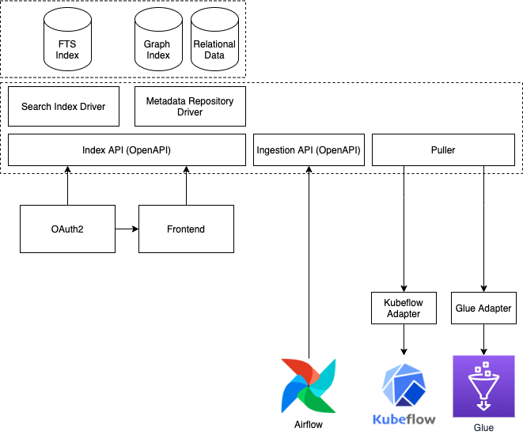
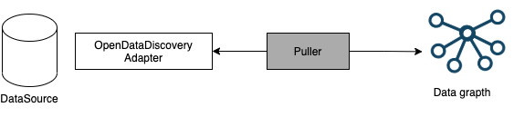

# OpenDataDiscovery Redshift adapter (ODD Redshift adapter)

Version: 0.0.1

## OpenDataDiscovery Redshift adapter scope

ODD Redshift adapter is used OpenDataDiscovery for pull metadata to OpenDataDiscovery from AWS Amazon Redshift.

## Discovery process

Metadata discovery process is very simular to metrics/logs/traces gathering process. We might have pull or push model.
OpenDataDiscovery use pull model for ODD Redshift adapter.



### Push model

See OpenDataDiscovery documentation.

### Pull model

Pulling metadata directly from the source seems is the most straightforward way to gather metadata,
but it may become a nightmare to develope and maintain a centralized fleet of domain-specific crawlers.
OpenDataDiscovery introduces new entity: OpenDataDiscovery Adapter. In this case, ODD Redshift adapter.
The main goal of these adapters are to be source specific and expose only information
could be gathered from certain data source.



Preferred if:

* Latency on index update is ok
* There is already an adapter

## Deployment

ODD Redshift adapter is Python Flask application composed to Docker image.
Web server is gunicorn. DB API library is psycopg2.
For details about image see docker-compose.yml and Dockerfile. Use this files for local tests and development.
In production Kubernetes on Amazon EKS (Amazon Elastic Kubernetes Service) can be used to run ODD Redshift adapter.
See Helm Charts files for example.

### Endpoint http://0.0.0.0:8080/entities/

ODD Redshift adapter start endpoint http://0.0.0.0:8080/entities/ by default,
and it connects to Redshift for collect metadata.

### Environmental variables

ODD Redshift adapter used next environmental variables:

Cache refreshing interval (minutes), default 60:
- SCHEDULER_INTERVAL_MINUTES=60

ODD Redshift adapter used PostgreSQL driver and setting for it:
- ODD_DATA_SOURCE_NAME=...redshift.amazonaws.com
- ODD_DATA_SOURCE=postgresql://
- PGHOST=...redshift.amazonaws.com
- PGPORT=5439
- PGDATABASE=oddadapter
- PGUSER=oddadapter
- PGPASSWORD=odd-adapter-password

More details see https://www.postgresql.org/docs/current/libpq-envars.html
`
33.14. Environment Variables
PGHOST behaves the same as the host connection parameter.
PGHOSTADDR behaves the same as the hostaddr connection parameter.
This can be set instead of or in addition to PGHOST to avoid DNS lookup overhead.
PGPORT behaves the same as the port connection parameter.
PGDATABASE behaves the same as the dbname connection parameter.
PGUSER behaves the same as the user connection parameter.
PGPASSWORD behaves the same as the password connection parameter.
Use of this environment variable is not recommended for security reasons,
as some operating systems allow non-root users to see process environment variables via ps;
instead consider using a password file (see Section 33.15).
`

Variables for FLASK see in documentation, for example:
- FLASK_ENVIRONMENT=development

## Endpoint /entities OpenAPI 3 specification

ODD Redshift adapter provides list of available metadata entities updated after changed_since time:

```yaml
openapi: 3.0.3
info:
  title: OpenDataDiscovery Adapter Contract
  version: 0.0.22
  description: OpenDataDiscovery Adapter Contract
  license:
    name: Apache 2.0
    url: https://www.apache.org/licenses/LICENSE-2.0.html
paths:
  /entities:
    get:
      description: Provides list of available entities
      operationId: getDataEntities
      tags:
        - OpenDataDiscoveryAdapter
      parameters:
        - in: query
          name: changed_since
          schema:
            type: string
            format: date-time
          description: Get data enitites updated after changed_since date
      responses:
        '200':
          description: OK
          content:
            application/json:
              schema:
                $ref: '#/components/schemas/DataEntityList'
```

## DataModel

Knowledge about data is spread amongst many people and systems.
OpenDataDiscovery role is to provide a standard protoocol how metadata can be collected and
correlated in as automated fashion as possible.
To enable many different datasources and tools to expose the metadata we need agreement
on what data should be exposed and in what format (structures).
Specification contains of high level entities:
- DataInput,
- DataTransformer (DataTransformerRun),
- DataSet
- DataQualityTest (DataQualityTest)
- DataConsumer.

Each entity has a unique url describing a place, system and an identifier in this system.

ODD Redshift adapter map Amazon Redshift metadata to OpenDataDiscovery metadata by Specification.
Mapping details and examples see below.

### DONE: BaseObject, DataEntity, DataEntityList, MetadataExtension

BaseObject and DataEntity is base components for other metadata components.
DataEntityList is list all types of DataEntity and it has data_source_oddrn.

Format ODDRN:
- DataEntityList.data_source_oddrn  
  format: f'//aws/123456789012/redshift/{ODD_DATA_SOURCE_NAME}'  
  example: "//aws/123456789012/redshift/odd-redshift-adapter.c0mxpzchxkqz.us-west-2.redshift.amazonaws.com/"
- BaseObject.owner, DataSet.parent_oddrn  
  format: f'{data_source_oddr}/databases/{catalog_name}/schemas/{schema_name}'  
  example: "//aws/123456789012/redshift/odd-redshift-adapter.c0mxpzchxkqz.us-west-2.redshift.amazonaws.com/databases/oddadapter/schemas/smith"
- BaseObject.oddrn for DataSet, DataSetField.parent_field_oddrn  
  format: f'{data_source_oddr}/databases/{catalog_name}/schemas/{schema_name}/tables/{table_name}'  
  example: "//aws/123456789012/redshift/odd-redshift-adapter.c0mxpzchxkqz.us-west-2.redshift.amazonaws.com/databases/oddadapter/schemas/public/tables/event"
- BaseObject.oddrn for DataSetField  
  format: f'{dataset_oddr}/columns/{column_name}'  
  example: "//aws/123456789012/redshift/odd-redshift-adapter.c0mxpzchxkqz.us-west-2.redshift.amazonaws.com/databases/oddadapter/schemas/public/tables/event/columns/eventid"
- BaseObject.oddrn for DataTransformer  
  format: f'{data_source_oddr}/databases/{catalog_name}/schemas/{schema_name}/functions/{function_name}'  
  example: "//aws/123456789012/redshift/odd-redshift-adapter.c0mxpzchxkqz.us-west-2.redshift.amazonaws.com/databases/oddadapter/schemas/public/functions/start_event"
- BaseObject.oddrn for DataTransformerRun  
  format: f'{data_source_oddr}/databases/{catalog_name}/schemas/{schema_name}/functions/{function_name}/calls/{calls_id}'  
  example: "//aws/123456789012/redshift/odd-redshift-adapter.c0mxpzchxkqz.us-west-2.redshift.amazonaws.com/databases/oddadapter/schemas/public/functions/start_event/calls/123456"

Format DataEntity.created_at, DataEntity.updated_at and other values of datetime type:  
format: %Y-%m-%dT%H:%M:%SZ  
example: 2021-12-31T23:59:59UTC  
python: datetime.isoformat()

MetadataExtension.schema_url field use definitions from file schema:  
https://raw.githubusercontent.com/opendatadiscovery/opendatadiscovery-specification/main/specification/extensions/redshift.json

Format and examples:

```yaml
components:
  schemas:
    BaseObject:
      type: object
      properties:
        oddrn:
          type: string
          example: "//aws/123456789012/redshift/odd-redshift-adapter.c0mxpzchxkqz.us-west-2.redshift.amazonaws.com/databases/oddadapter/schemas/public/tables/event/columns/eventid"
        name:
          type: string
          example: "eventid"
        owner:
          type: string
          example: "//aws/123456789012/redshift/odd-redshift-adapter.c0mxpzchxkqz.us-west-2.redshift.amazonaws.com/databases/oddadapter/schemas/smith"
        metadata:
          type: array
          items:
            $ref: "#/components/schemas/MetadataExtension"
      required:
        - oddrn
        - name

    DataEntity:
      allOf:
        - $ref: '#/components/schemas/BaseObject'
        - type: object
          properties:
            updated_at:
              type: string
              format: date-time
              example: 2021-12-31T23:59:59UTC
            created_at:
              type: string
              format: date-time
              example: 2021-12-31T23:59:59UTC
            dataset:
              $ref: '#/components/schemas/DataSet'
            data_transformer:
              $ref: '#/components/schemas/DataTransformer'
            data_transformer_run:
              $ref: '#/components/schemas/DataTransformerRun'
            data_quality_test:
              $ref: '#/components/schemas/DataQualityTest'
            data_quality_test_run:
              $ref: '#/components/schemas/DataQualityTestRun'
            data_input:
              $ref: '#/components/schemas/DataInput'
            data_consumer:
              $ref: '#/components/schemas/DataConsumer'

    DataEntityList:
      type: object
      properties:
        data_source_oddrn:
          type: string
          example: "//aws/123456789012/redshift/odd-redshift-adapter.c0mxpzchxkqz.us-west-2.redshift.amazonaws.com/"
        items:
          type: array
          items:
            $ref: '#/components/schemas/DataEntity'
            
    MetadataExtension:
      type: object
      properties:
        schema_url:
          description: "The JSON Pointer (https://tools.ietf.org/html/rfc6901) URL to the corresponding version of the schema definition for this extension"
          example: "https://raw.githubusercontent.com/opendatadiscovery/opendatadiscovery-specification/main/specification/extensions/redshift.json#/definitions/RedshiftDataSetExtension"
          type: string
          format: uri
        metadata:
          type: object
          additionalProperties: true
      required:
        - schema_url
        - metadata
```


### DONE: DataSet, DataSetField, DataSetFieldType

DataSet is a collection of data stored in structured format.
In ODD Redshift adapter it might be a base table, view, materialized view, external table,
external view, external materialized view, shared table, temporary table.

Redshift views PG_CATALOG.SVV_TABLES, PG_CATALOG.SVV_ALL_TABLES, PG_CATALOG.SVV_REDSHIFT_TABLES, PG_CATALOG.SVV_EXTERNAL_TABLES, PG_CATALOG.SVV_TABLE_INFO
maps to DataSet, BaseObject, DataEntity, MetadataExtension entities.

Redshift views PG_CATALOG.SVV_ALL_COLUMNS, PG_CATALOG.SVV_REDSHIFT_COLUMNS, PG_CATALOG.SVV_EXTERNAL_COLUMNS
maps to DataSetField, DataSetFieldType, BaseObject, DataEntity, MetadataExtension entities

Format and examples:

```yaml
    DataSet:
      type: object
      properties:
        parent_oddrn:
          type: string
          example: "//aws/123456789012/redshift/odd-redshift-adapter.c0mxpzchxkqz.us-west-2.redshift.amazonaws.com/databases/oddadapter/schemas/smith"
        description:
          type: string
        rows_number:
          type: integer
          format: int64
          example: 0
        subtype:
          type: string
          enum:
            - DATASET_TABLE
            - DATASET_VIEW
            - DATASET_MATERIALIZED_VIEW
            - DATASET_EXTERNAL_TABLE
            - DATASET_EXTERNAL_VIEW
            - DATASET_EXTERNAL_MATERIALIZED_VIEW
            - DATASET_EXTERNAL_UNKNOWN
            - DATASET_SHARED_TABLE
            - DATASET_TEMPORARY_TABLE
            - DATASET_FILE
            - DATASET_FEATURE_GROUP
            - DATASET_TOPIC
            - DATASET_UNKNOWN
        field_list:
          type: array
          items:
            $ref: '#/components/schemas/DataSetField'
      required:
        - subtype
        - field_list

DataSetField:
  allOf:
    - $ref: '#/components/schemas/BaseObject'
    - type: object
      properties:
        parent_field_oddrn:
          type: string
          example: "//aws/123456789012/redshift/odd-redshift-adapter.c0mxpzchxkqz.us-west-2.redshift.amazonaws.com/databases/oddadapter/schemas/public/tables/event"
        type:
          $ref: '#/components/schemas/DataSetFieldType'
        is_key:
          type: boolean
        is_value:
          type: boolean
        default_value:
          type: string
        description:
          type: string
        stats:
          $ref: '#/components/schemas/DataSetFieldStat'
      required:
        - type

DataSetFieldType:
  type: object
  properties:
    type:
      type: string
      enum:
        - TYPE_STRING
        - TYPE_NUMBER
        - TYPE_INTEGER
        - TYPE_BOOLEAN
        - TYPE_CHAR
        - TYPE_DATETIME
        - TYPE_STRUCT
        - TYPE_BINARY
        - TYPE_LIST
        - TYPE_MAP
        - TYPE_UNION
        - TYPE_DURATION
        - TYPE_UNKNOWN
    logical_type:
      type: string
    is_nullable:
      type: boolean
  required:
    - type
    - is_nullable
```

### DONE: DataTransformer

Redshift view PG_CATALOG.SVV_REDSHIFT_FUNCTIONS maps to DataTransformer entity.
Column pg_catalog.pg_proc.prosrc maps to DataTransformer.sql field.
DataTransformer.source_code_url field is not used.

Amazon Redshift has next types of functions:
- stored procedures,
- regular functions,
- aggregate functions.

Format and examples:

```yaml
    DataTransformer:
      type: object
      properties:
        description:
          type: string
        source_code_url:
          type: string
        sql:
          type: string
        inputs:
          type: array
          items:
            type: string
        outputs:
          type: array
          items:
            type: string
        subtype:
          type: string
          enum:
            - DATATRANSFORMER_JOB
            - DATATRANSFORMER_EXPERIMENT
            - DATATRANSFORMER_ML_MODEL_TRAINING
            - DATATRANSFORMER_STORED_PROCEDURE
            - DATATRANSFORMER_FUNCTION
            - DATATRANSFORMER_AGGREGATED_FUNCTION
            - DATATRANSFORMER_UNKNOWN
      required:
        - inputs
        - outputs
        - subtype
```

### DONE: DataTransformerRun

Redshift view PG_CATALOG.SVL_STORED_PROC_CALL maps to DataTransformerRun entity.
DataTransformerRun.status field has 2 state only (SUCCESS or ABORTED).

```yaml
    DataTransformerRun:
      type: object
      properties:
        transformer_oddrn:
          type: string
          example: "//aws/123456789012/redshift/odd-redshift-adapter.c0mxpzchxkqz.us-west-2.redshift.amazonaws.com/databases/oddadapter/schemas/public/functions/start_event"
        start_time:
          type: string
          format: date-time
        end_time:
          type: string
          format: date-time
        status_reason:
          type: string
        status:
          type: string
          enum:
            - SUCCESS
            - FAIL
            - ABORTED
            - OTHER
      required:
        - transformer_oddrn
        - start_time
        - end_time
        - status
```

### MAYBE NEED:
#### DataSetStat, DataSetFieldStat
#### BooleanFieldStat, ComplexFieldStat, NumberFieldStat, StringFieldStat, BinaryFieldStat, IntegerFieldStat, DateTimeFieldStat

### NOT USED:
#### DataInput, DataConsumer
#### DataSetQualityTest, DataQualityTestRun
#### LinkedUrl
